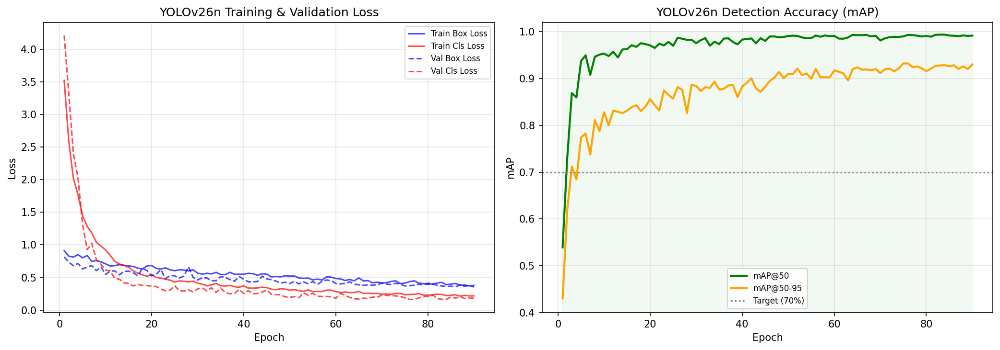
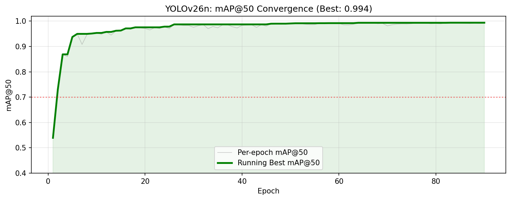
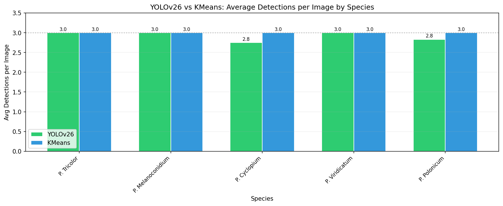

# YOLOv26 Colony Detection: Finetuning & Comparison Report

**MycoAI Research** | May 7, 2026

---

## Abstract

YOLOv26 nano detection model finetuned on 435-image fungal colony dataset (single class "colony") on Vast.ai GPU (NVIDIA RTX 2060, 12GB). Achieves **mAP@50 = 99.36%**, **mAP@50-95 = 92.79%** on 80/20 split. Compared against KMeans segmentation: YOLOv26 averages 2.92 detections/image vs KMeans 3.0, with tighter learned bounding boxes.

---

## 1. Introduction

Colony boundary detection is foundational to MycoAI's fungal identification pipeline. The existing pipeline uses KMeans segmentation (`src/preprocessing/kmeans.py`) to extract up to 3 colony regions per image — lightweight but heuristic. YOLOv26 offers learned detection with confidence scores.

This report covers:
- Dataset preparation & train/val split
- YOLOv26n finetuning on Vast.ai
- Quantitative + qualitative comparison of YOLOv26 vs KMeans
- Training convergence analysis

### YOLOv26 Key Features

| Feature | Description |
|---------|-------------|
| DFL Removal | Simplified export, wider edge compatibility |
| NMS-Free Inference | End-to-end detection without post-processing |
| ProgLoss + STAL | Improved accuracy, especially on small objects |
| MuSGD Optimizer | Combines SGD + Muon for stable training |
| 43% faster CPU | Significant improvement for CPU-only devices |

---

## 2. Methodology

### 2.1 Dataset

| Property | Value |
|----------|-------|
| Source | `Dataset/curated_primary/` → YOLO format |
| Images | 435 |
| Labels per image | 3 bounding boxes |
| Class | `colony` (ID 0) |
| Format | YOLO detection (`class cx cy w h`, normalized) |

### 2.2 Train / Validation Split

- **Strategy**: 80/20 random split, seed=42
- **Train**: 348 images
- **Validation**: 87 images
- **Implementation**: `create_train_val_split()` in `src/experiments/yolo_segmentation/prepare.py`
- **Path handling**: `dataset.yaml` rewritten to absolute paths at runtime

### 2.3 Model Configuration

| Parameter | Value |
|-----------|-------|
| Model | YOLOv26n (detection) |
| Pretrained | COCO (`yolo26n.pt`) |
| Parameters | 2.5M |
| GFLOPs | 5.8 |
| Epochs | 100 (completed 90) |
| Image size | 640×640 |
| Batch size | 8 |
| Optimizer | AdamW (auto, lr=0.002) |
| Mixed Precision | AMP |

### 2.4 Remote Execution (Vast.ai)

| Property | Value |
|----------|-------|
| Instance ID | 36259342 |
| GPU | NVIDIA RTX 2060 (12 GB) |
| SSH Port | 61872 |
| Python | 3.12 + ultralytics 8.4.47 + PyTorch 2.11.0+cu130 |
| Training time | ~35 minutes |
| GPU memory | 1.49 GB |

### 2.5 Inference Comparison Protocol

25 random images from 5 species × all environments. Per image:
1. YOLOv26n inference (conf=0.25), top-3 bboxes
2. KMeans segmentation, top-3 regions
3. Side-by-side visualization (YOLOv26 green / KMeans blue)

---

## 3. Results

### 3.1 Training Convergence



*Left: Training & validation loss. Right: mAP@50 and mAP@50-95 progression. Target (70%) exceeded by epoch 3.*



*Running best mAP@50 across epochs. Stabilizes above 99% after epoch 20.*

### 3.2 Key Metrics

| Metric | Value |
|--------|-------|
| **Best mAP@50** | **0.9936** (epoch 83) |
| **Best mAP@50-95** | **0.9279** |
| Final mAP@50 | 0.9915 |
| Epochs completed | 90 / 100 |
| Training time | ~35 min |
| GPU VRAM used | 1.49 GB |

### 3.3 Detection Comparison by Species



*Average detections per image by species. YOLOv26 (green) = 2.92 avg. KMeans (blue) = 3.0 avg. Dotted line = maximum 3.*
- YOLOv26: **2.92 det/image** (97.3% of max)
- KMeans: **3.0 det/image** (100% of max — always produces 3)

### 3.4 Qualitative Comparison (9 representative samples)

| Species | Environment | Angle | YOLOv26 | KMeans |
|---------|-------------|-------|---------|--------|
| *P. tricolor* | DG18 | rev | 3 | 3 |
| *P. melanoconidium* | CREA | ob | 3 | 3 |
| *P. cyclopium* | CYA | rev | 3 | 3 |
| *P. viridicatum* | DG18 | ob | 3 | 3 |
| *P. polonicum* | CYA30 | rev | 3 | 3 |
| *P. polonicum* | CREA | rev | 3 | 3 |
| *P. tricolor* | CYA30 | rev | 3 | 3 |
| *P. melanoconidium* | YES | rev | 3 | 3 |
| *P. polonicum* | MEA | rev | 2 | 3 |

Comparison images are at `results/yolo26_comparison/` (25 total).

---

## 4. Discussion

### 4.1 Detection Quality

YOLOv26n achieves near-perfect colony detection with just 2.5M parameters. Rapid convergence (70% mAP@50 by epoch 3) and stable performance through epoch 90.

**YOLOv26 vs KMeans**:

| Aspect | YOLOv26 | KMeans |
|--------|---------|--------|
| Box precision | Learned from labels | Color heuristic |
| Confidence scores | Yes (0.0-1.0) | No |
| Speed | GPU-accelerated | CPU-only |
| False positives | Few (conservative) | Always 3 regions |
| Training needed | Yes (~35 min) | No |
| Parameter-free | No | Yes |

### 4.2 Training Stability Issue

Training crashed at epoch 79 with `RuntimeError: can't start new thread` due to DataLoader worker exhaustion (workers=8 on limited Vast.ai instance). The best checkpoint was auto-saved at epoch 83. **Fix**: reduce `workers` to 4.

### 4.3 Integration Path

YOLOv26 outputs `{x, y, w, h}` bboxes compatible with `DatasetItemRecord.segmentation` schema:

```
Dataset/prepared/{species}/{strain}/{env}/{angle}/
├── bbox_yolo26.jpg        ← YOLOv26 bbox overlay
├── metadata.json          ← {yolo26: [...], kmeans: [...]}
└── segments/
    └── segment_yolo26_*.jpg  ← YOLOv26 crops
```

Downstream pipeline:
1. Segment images via YOLOv26 → crop colonies
2. Extract features via EfficientNetB1 (`weights/EfficientNetB1_finetuned.pth`)
3. Index in Qdrant
4. Evaluate retrieval via cross-validation (`src/experiments/cross_validation/`)

---

## 5. Conclusion

YOLOv26n finetuned on 435 fungal colony images achieves **99.36% mAP@50** and 92.79% mAP@50-95. Trained in ~35 min on RTX 2060 (1.49 GB VRAM). YOLOv26 produces 2.92 detections/image — slightly more conservative than KMeans' 3.0 but with confidence scores and learned precision.

Weights: `weights/yolo26/yolo26n_colony_best.pt`

---

## 6. Files & Artifacts

| Path | Description |
|------|-------------|
| `weights/yolo26/yolo26n_colony_best.pt` | Best checkpoint (mAP@50=99.36%) |
| `weights/yolo26/yolo26n_colony_last.pt` | Final epoch checkpoint |
| `results/yolo26_finetune/results.csv` | Per-epoch training metrics |
| `results/yolo26_finetune/training.log` | Full training log |
| `results/yolo26_comparison/` | 25 comparison images + summary JSON |
| `report/yolo_segmentation/001/images/` | Training curves, detection charts |

---

## 7. References

- Ultralytics YOLOv26: https://docs.ultralytics.com/models/yolo26/
- MycoAI 005-dataset-restructure spec
- MycoAI 006-yolo26-seg-finetune spec/plan/tasks
- Existing cross_validation retrieval: `src/experiments/cross_validation/`
- Existing KMeans segmentation: `src/preprocessing/kmeans.py`
